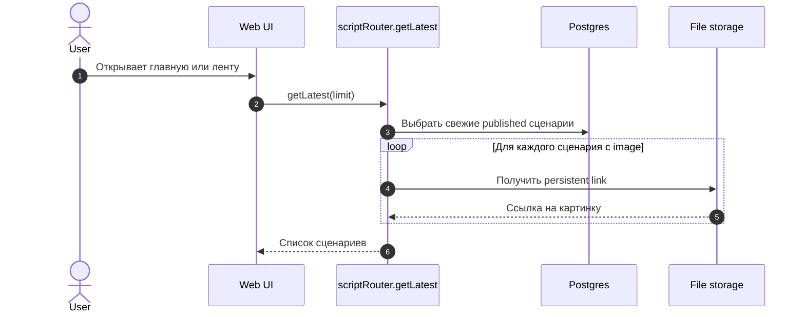
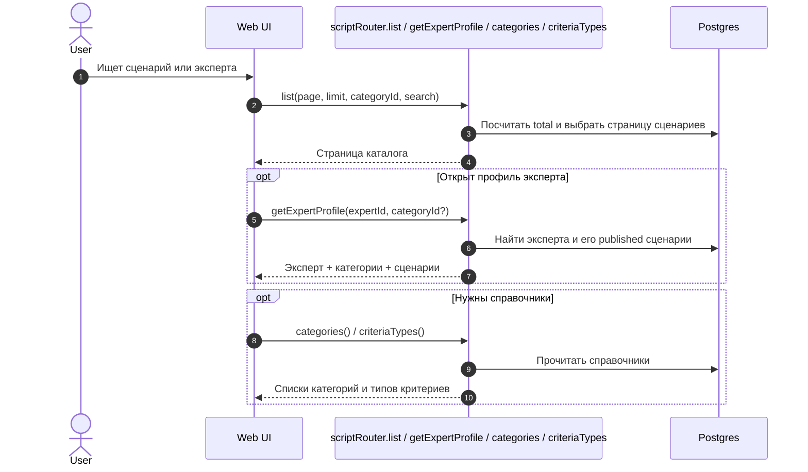
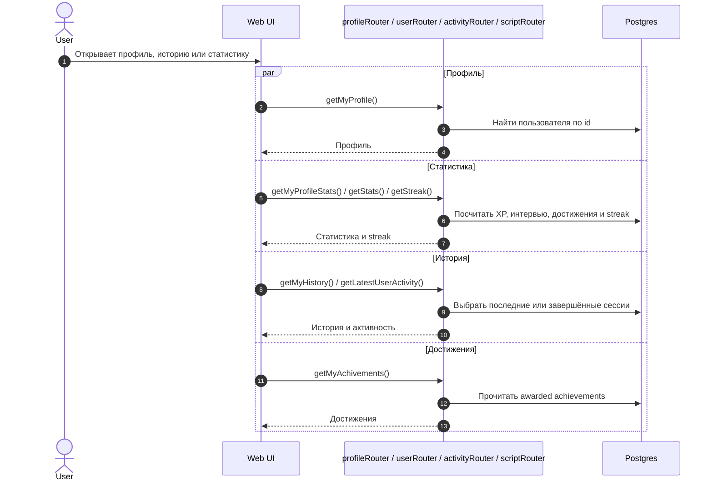
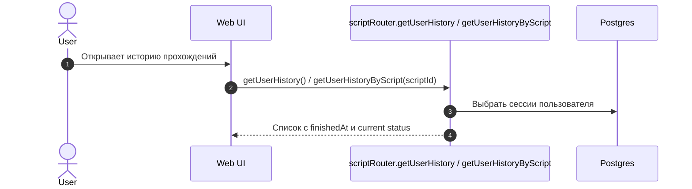

# Контент, Каталог И Профиль

Этот файл покрывает все read-only сценарии, где пользователь смотрит сценарии, профиль, историю и быстрые метрики.

## Кейсы

- Просмотр карточки сценария.
- Получение последних сценариев.
- Список сценариев с фильтрами и пагинацией.
- Просмотр профиля эксперта.
- Получение справочников категорий и типов критериев.
- Просмотр собственного профиля и статистики.
- Просмотр собственной истории и достижений.
- Получение последней активности.
- Получение истории по сценарию.

## Участники

- `User` - обычный пользователь или эксперт.
- `Web UI` - экран каталога, профиля или истории.
- `tRPC API` - `scriptRouter`, `profileRouter`, `userRouter`, `activityRouter`.
- `Postgres` - выборки из `scripts`, `users`, `interview_sessions`, `achievements`.
- `File storage` - только для `getLatest`, когда у сценария есть картинка.

## Карточка Сценария

```mermaid
sequenceDiagram
    autonumber
    actor User
    participant UI as Web UI
    participant API as scriptRouter.getInfo
    participant DB as Postgres

    User->>UI: Открывает страницу сценария
    UI->>API: getInfo(scriptId)
    API->>DB: Найти published сценарий без soft delete
    alt сценарий не найден
        API-->>UI: NOT_FOUND
    else сценарий найден
        API-->>UI: Карточка сценария + эксперт + категория
    end
```

## Последние Сценарии

## Каталог И Эксперт

## Профиль И История

## История По Сценарию

