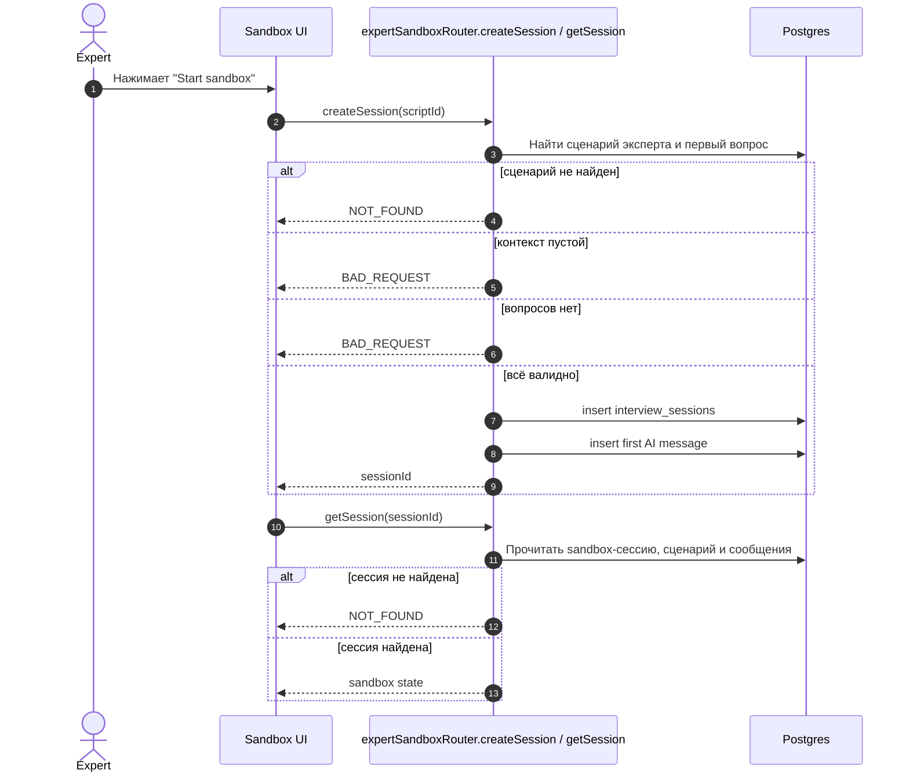
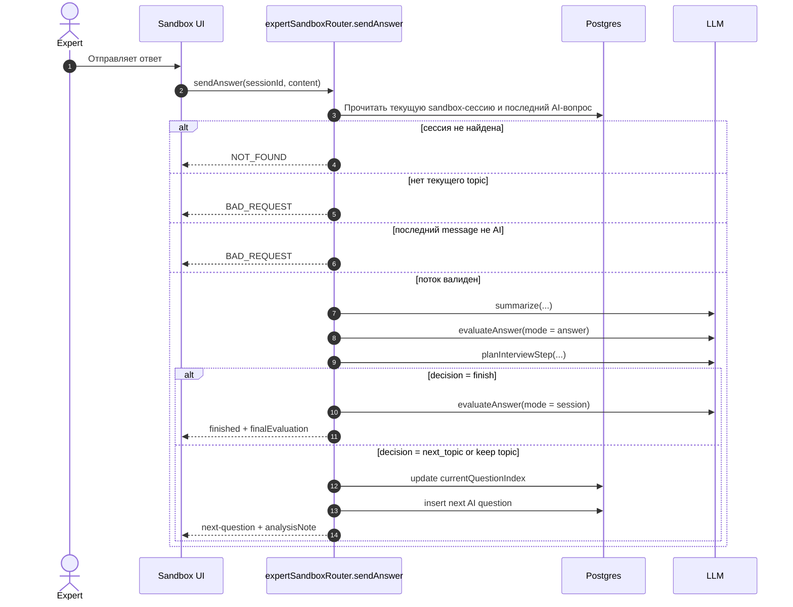
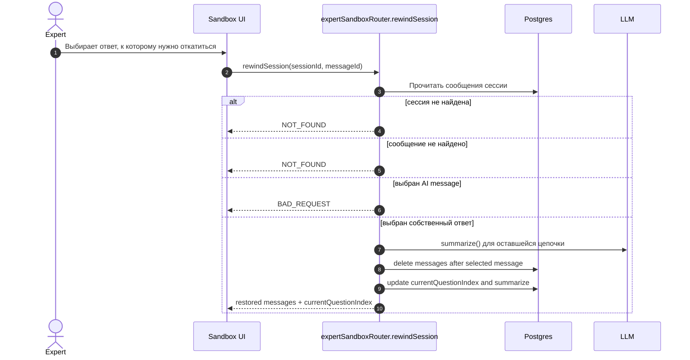

# Sandbox-Сессии Для Эксперта

Sandbox нужен, чтобы эксперт мог прогнать свой сценарий как кандидат и проверить вопросы, суммаризацию и ветвление без влияния на боевую сессию.

## Кейсы

- Создание sandbox-сессии.
- Получение состояния sandbox-сессии.
- Отправка ответа и переход к следующему вопросу.
- Отправка ответа и завершение прогонки.
- Откат к предыдущему ответу.

## Участники

- `Expert` - автор сценария.
- `Sandbox UI` - интерфейс прогонки.
- `tRPC API` - `expertSandboxRouter`.
- `Postgres` - sandbox-сессия и сообщения.
- `LLM` - суммаризация, оценка ответа, планирование следующего шага.

## Создание И Просмотр

## Ответ И Следующий Вопрос

## Откат К Ответу

