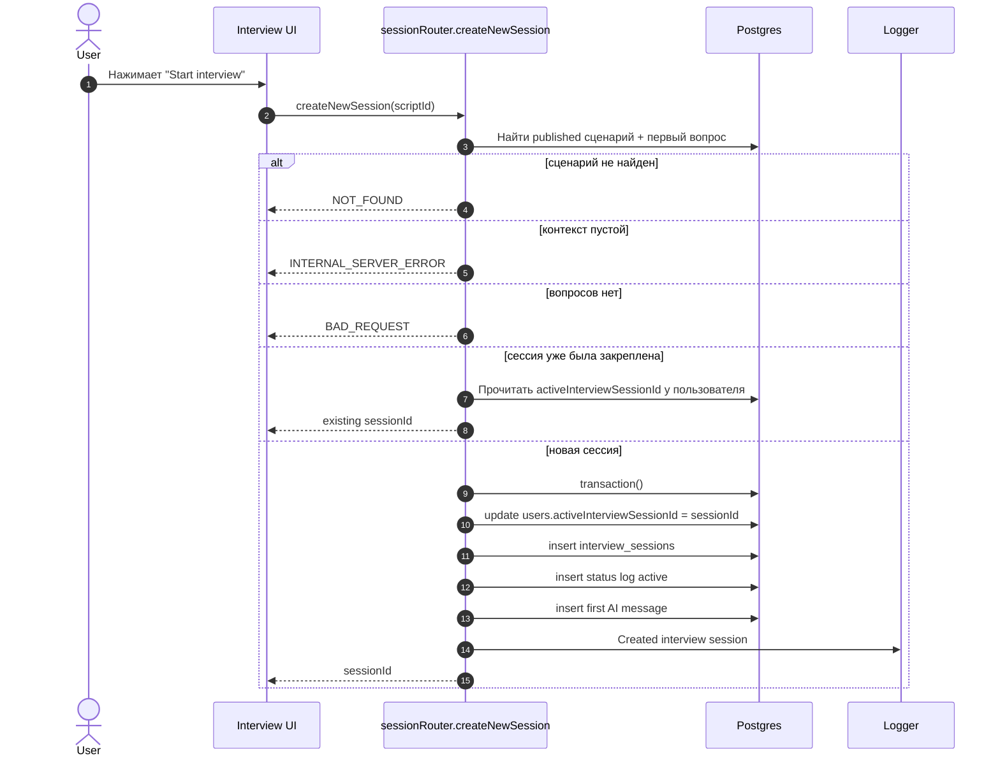
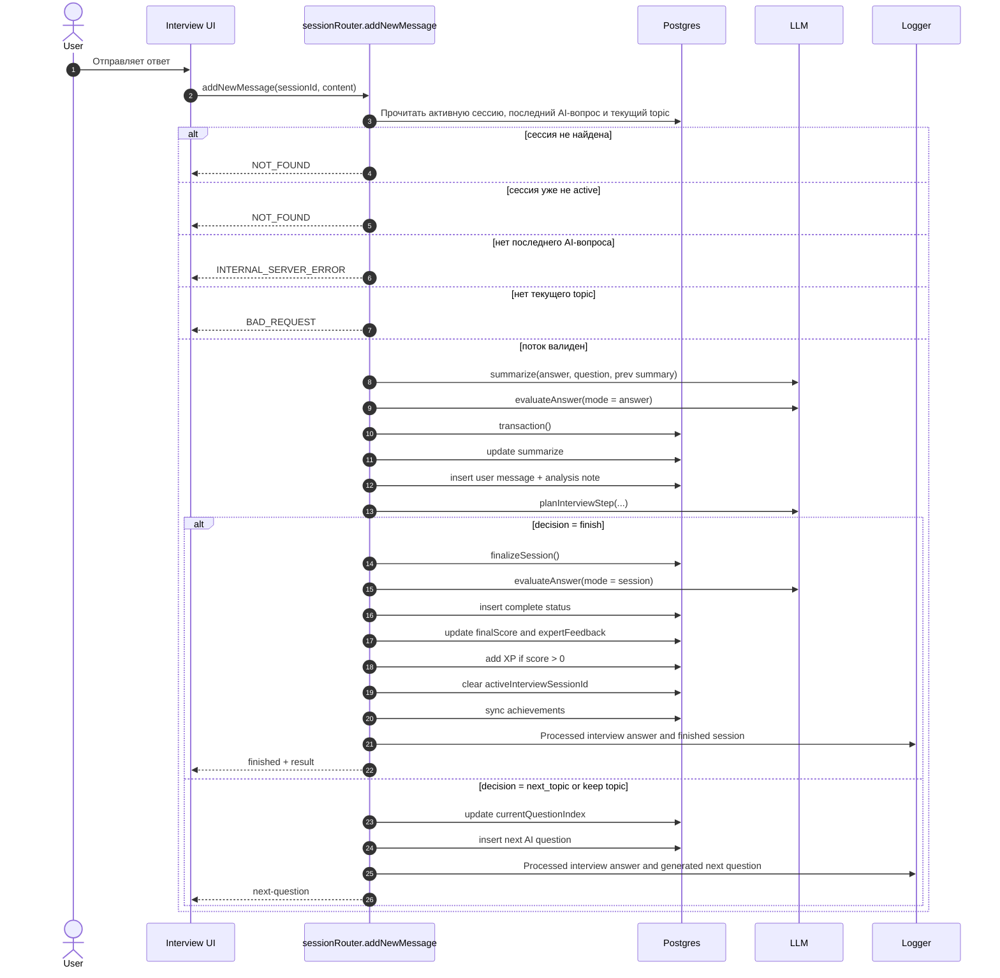
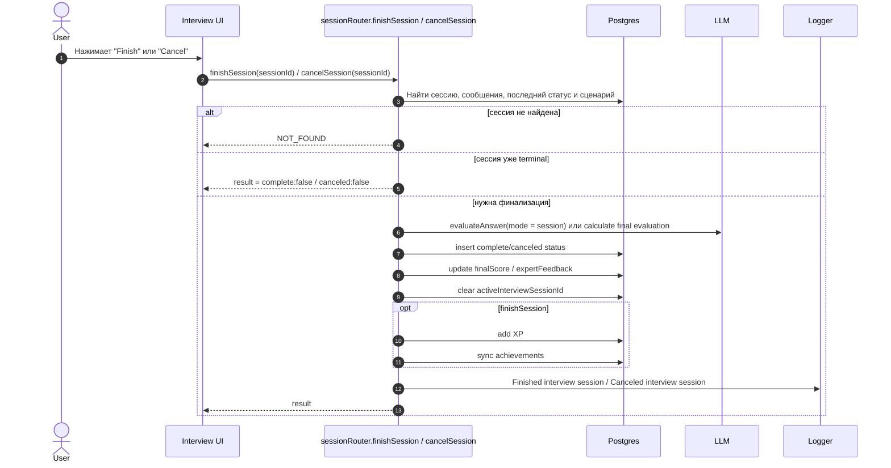
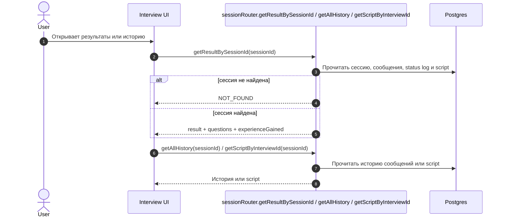

# Жизненный Цикл Интервью-Сессии

Этот файл описывает основной продуктовый поток: создание интервью, получение первого вопроса, ответы, финализацию, отмену и просмотр результата.

## Кейсы

- Создание новой интервью-сессии.
- Получение сценария по interview id.
- Получение истории сообщений.
- Отправка ответа и получение следующего вопроса.
- Завершение интервью по решению планировщика.
- Ручное завершение интервью.
- Отмена интервью.
- Получение результата завершённой сессии.

## Участники

- `User` - кандидат.
- `Interview UI` - экран интервью.
- `tRPC API` - `sessionRouter`.
- `Postgres` - интервью-сессии, статус-логи, сообщения, XP.
- `LLM` - суммаризация, оценка ответа, планирование следующего шага.
- `Logger` - фиксация завершения, отмены и отправки ответа.

## Создание Сессии

## Ответ И Следующий Вопрос

## Ручное Завершение И Отмена

## Результат И История

