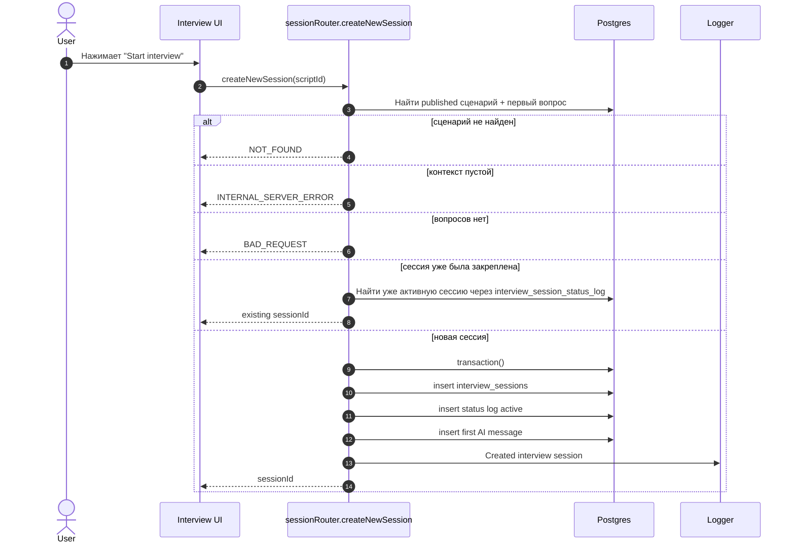
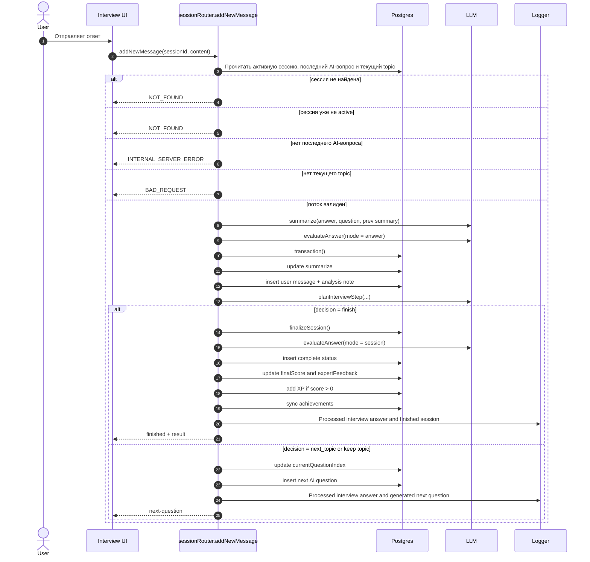

# Создание Сессии Интервью И Обработка Ответа

Этот файл оставляет только два базовых потока: создание сессии и обработку ответа с цепочкой LLM-вызовов.

## Создание Сессии

## Ответ И Следующий Вопрос

