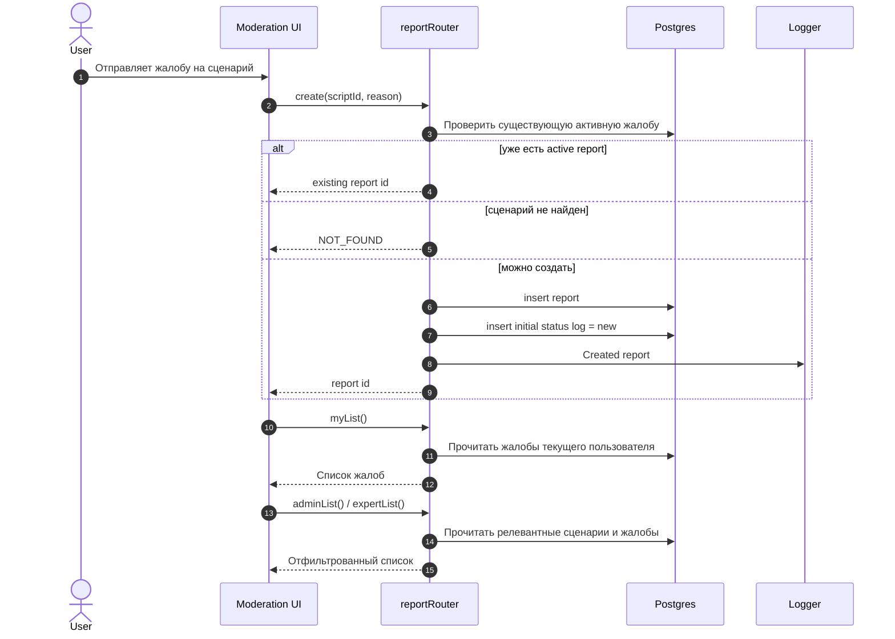
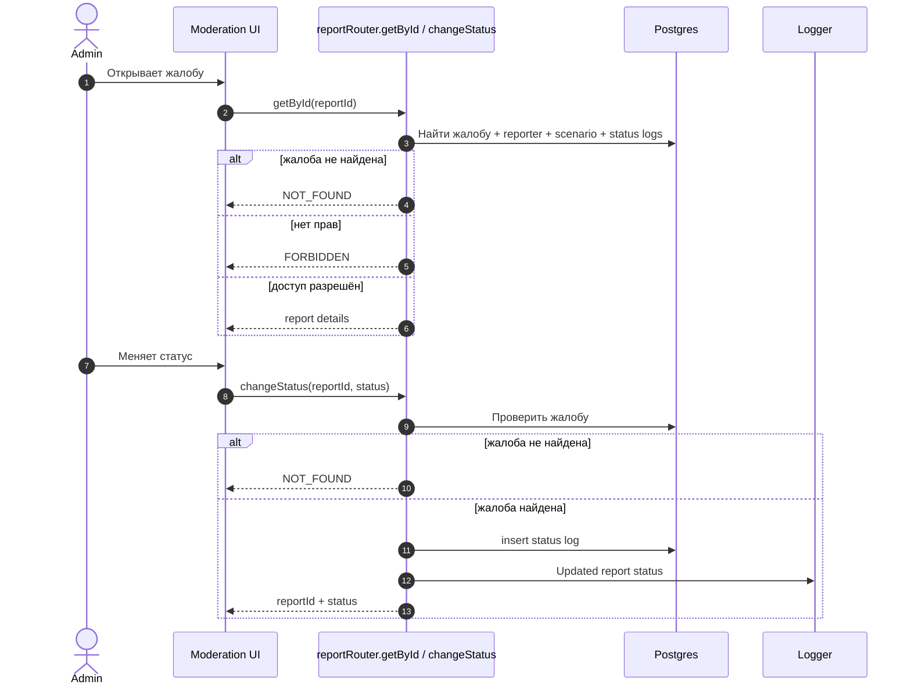
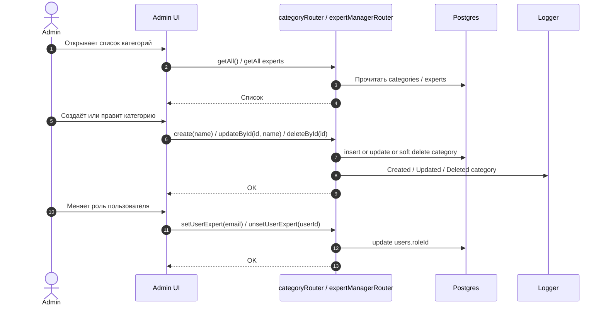
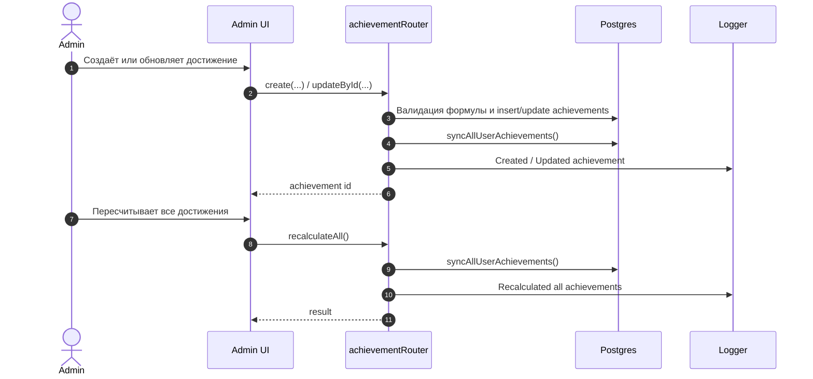

# Жалобы, Категории, Эксперты И Достижения

Этот файл собирает административные и moderation-сценарии. Здесь же лежат простые CRUD-потоки для категорий, экспертов и достижений.

## Кейсы

- Создание жалобы и защита от дубля.
- Получение своих жалоб.
- Получение жалобы по id.
- Список жалоб для админа и эксперта.
- Изменение статуса жалобы.
- CRUD категорий.
- Повышение и понижение эксперта.
- CRUD достижений и пересчёт наград.

## Участники

- `User` / `Expert` / `Admin` - инициатор.
- `Moderation UI` - экран жалоб, категорий или админ-панель.
- `tRPC API` - `reportRouter`, `categoryRouter`, `expertManagerRouter`, `achievementRouter`.
- `Postgres` - жалобы, статусы, категории, пользователи, достижения.
- `Logger` - запись действий админа и модерации.

## Жалобы

## Просмотр И Изменение Статуса Жалобы

## Категории И Эксперты

## Достижения

