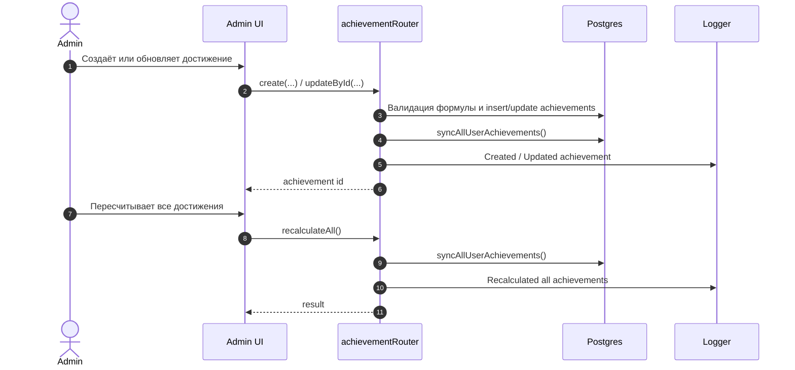

# Управление Достижениями И Каскадная Синхронизация

Оставлен только поток управления достижениями и каскадной синхронизацией.

## Достижения

```mermaid
sequenceDiagram
    autonumber
    actor Admin
    participant UI as Admin UI
    participant API as achievementRouter
    participant DB as Postgres
    participant Log as Logger

    Admin->>UI: Создаёт или обновляет достижение
    UI->>API: create(...) / updateById(...)
    API->>DB: Валидация формулы и insert/update achievements
    API->>DB: syncAllUserAchievements()
    API->>Log: Created / Updated achievement
    API-->>UI: achievement id

    Admin->>UI: Пересчитывает все достижения
    UI->>API: recalculateAll()
    API->>DB: syncAllUserAchievements()
    API->>Log: Recalculated all achievements
    API-->>UI: result
```
