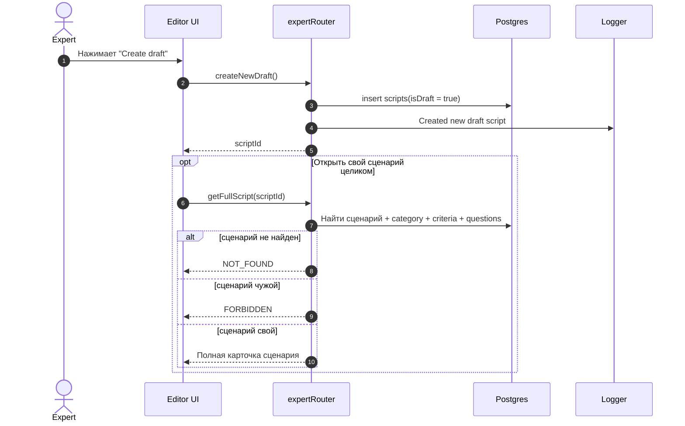
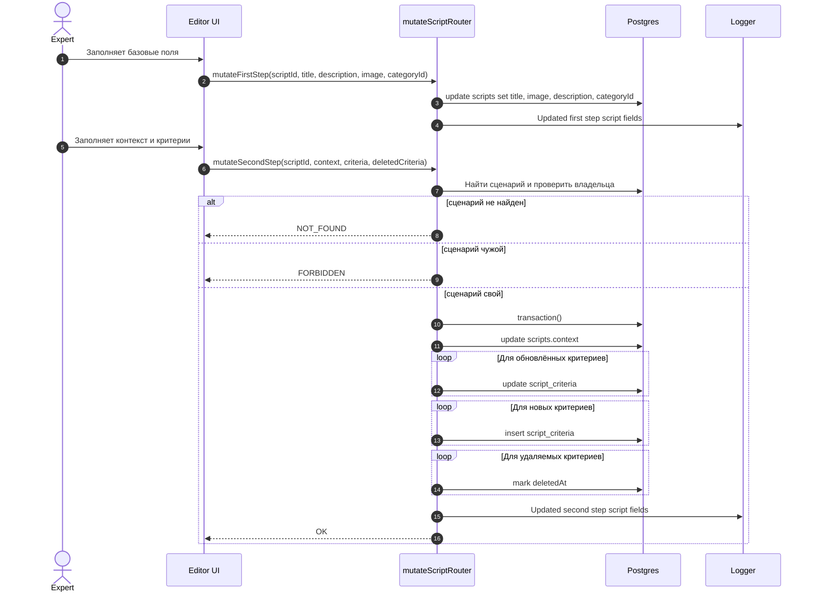
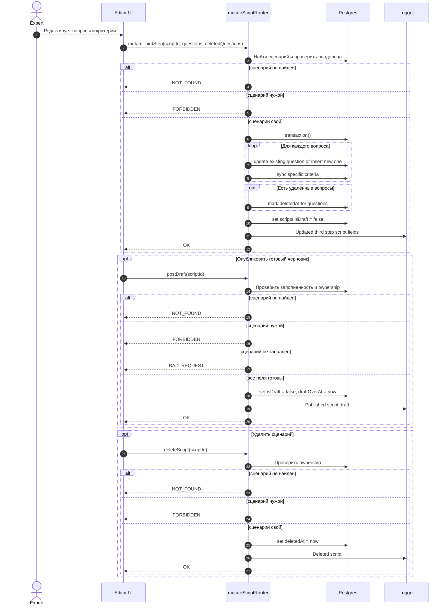

# Создание И Редактирование Сценария

Этот файл описывает все сценарии, где эксперт создаёт, редактирует, публикует или удаляет сценарий.

## Кейсы

- Создание нового черновика.
- Получение полной карточки своего сценария.
- Обновление первой шага формы.
- Обновление второго шага с критериями.
- Обновление третьего шага с вопросами и специфичными критериями.
- Публикация черновика.
- Удаление сценария.

## Участники

- `Expert` - автор сценария.
- `Editor UI` - экран редактирования сценария.
- `tRPC API` - `expertRouter` и `mutateScriptRouter`.
- `Postgres` - сценарии, критерии, вопросы.
- `Logger` - факт создания, публикации, удаления и обновления.

## Черновик И Полная Карточка

## Первый И Второй Шаг

## Третий Шаг, Публикация И Удаление

